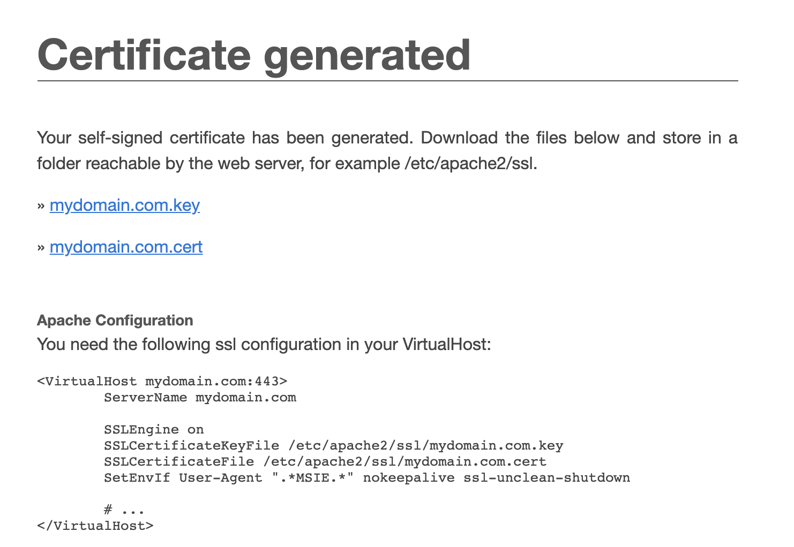

# Add SSL to local development
**Requirements:**
- MacOs
- Docker CE
---
- Using one in following ways to create certificate for domain in local
### #1 Install openssl cli
- After installed openssl
```
openssl req -x509 -out mydomain.com.crt -keyout mydomain.com.key \
  -newkey rsa:2048 -nodes -sha256 \
  -subj '/CN=mydomain.com' -extensions EXT -config <( \
   printf "[dn]\nCN=mydomain.com\n[req]\ndistinguished_name = dn\n[EXT]\nsubjectAltName=DNS:mydomain.com\nkeyUsage=digitalSignature\nextendedKeyUsage=serverAuth")
```
### #2 Generate using http://www.selfsignedcertificate.com
- Generate cert and key file




### Next step
- After having **crt** and **key** file for **mydomain.com**, mapping 2 file in nginx config.
- In nginx default config file map ssl to file **mydomain.com.crt** and **mydomain.com.key**
```
ssl_certificate     {path}/mydomain.com.crt
ssl_certificate_key {path}/mydomain.com.key
```
- modify /etc/hosts
127.0.0.1       mydomain.com

ping mydomain.com if not return 127.0.0.1 run `sudo dscacheutil -flushcache`


- Add **mydomain.com.crt** to **Keychain Access** on **MacOS**


- Open **https://mydomain.com** and verify


### Note
- Change **mydomain.com.crt** to **mydomain.com.cert** if using **http://www.selfsignedcertificate.com**
- Mount cert and key from host to container if using docker


